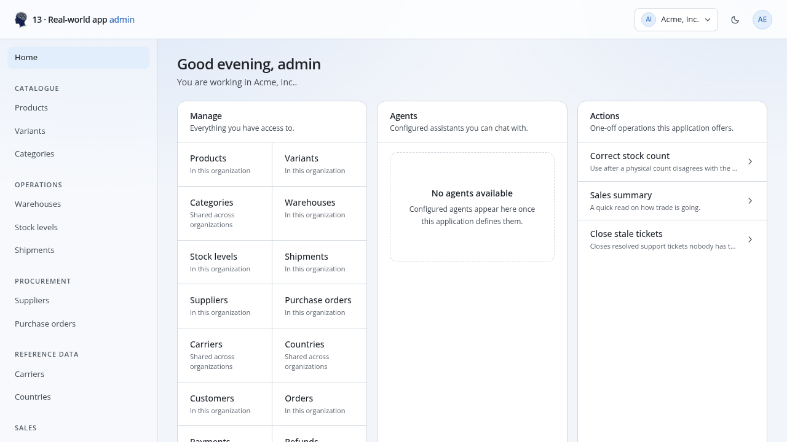
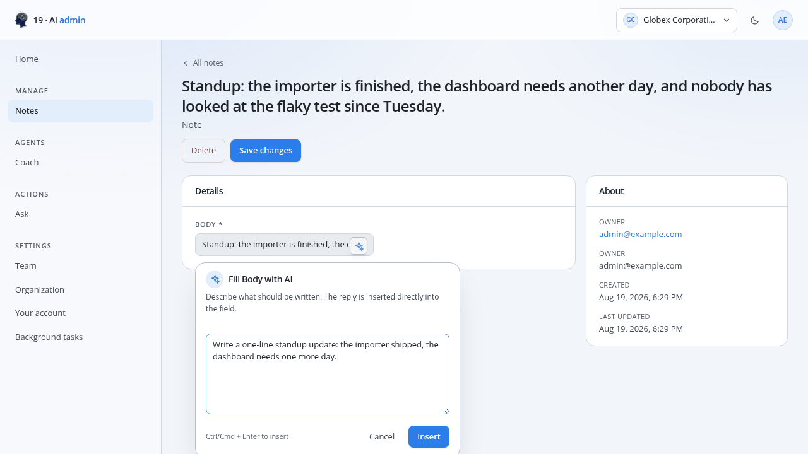
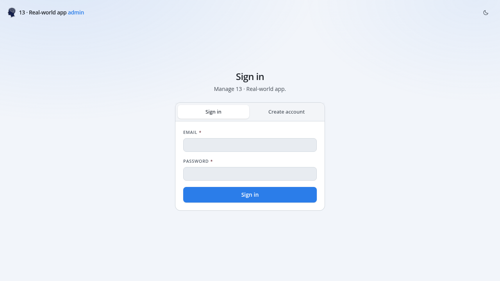
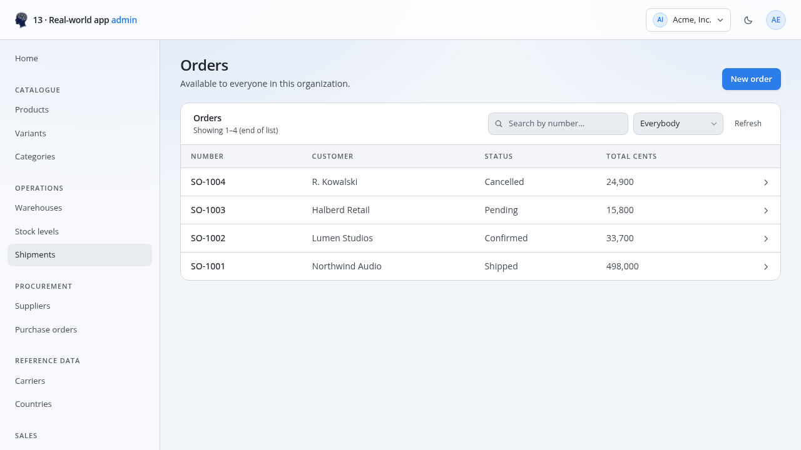
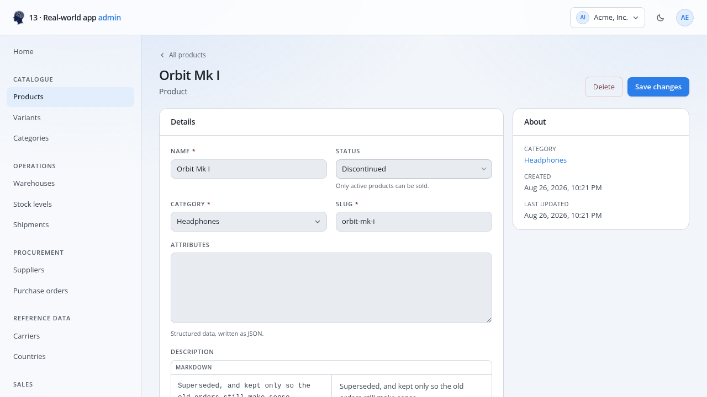
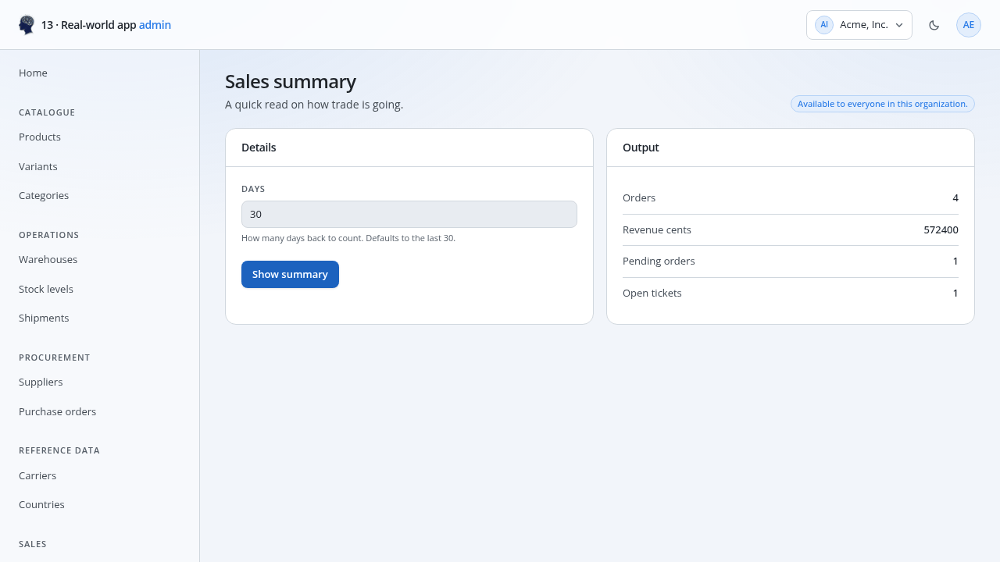
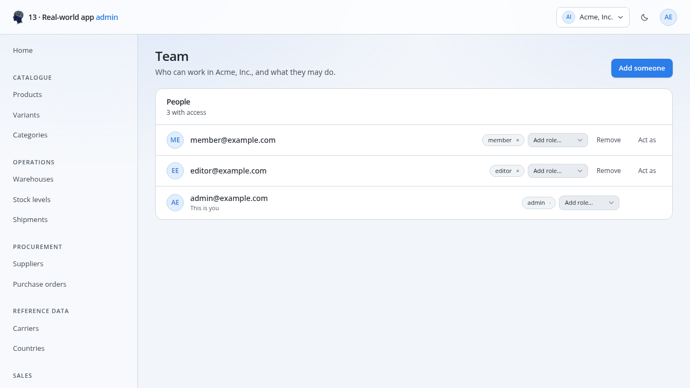
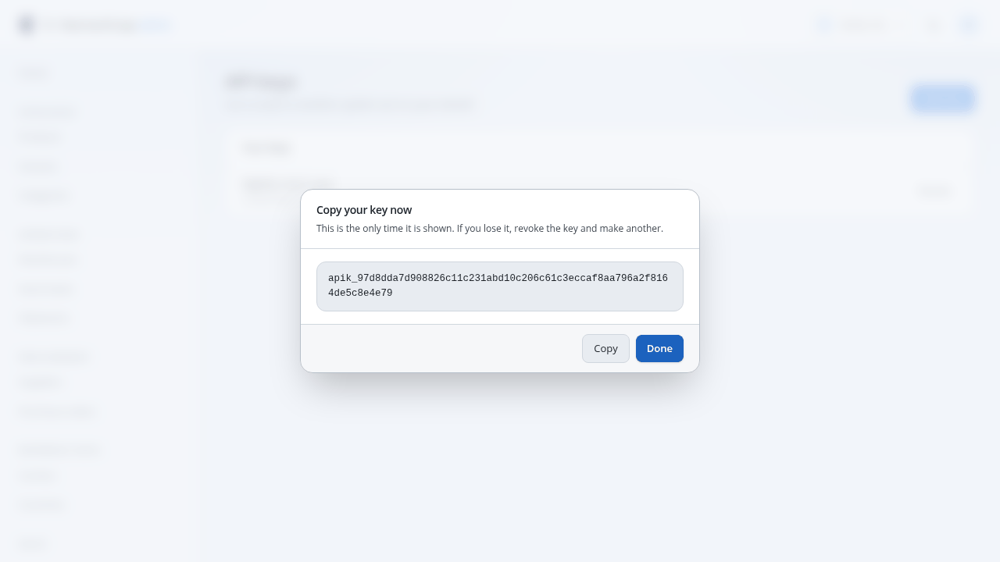
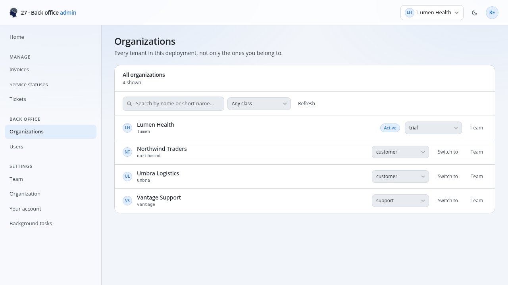
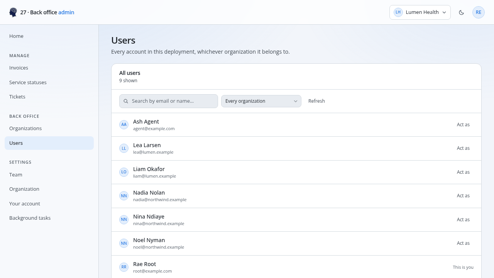

# The admin dashboard

The dashboard is aimed at **operators rather than developers**, so it shows
names rather than ids, forms rather than JSON, and only what the signed-in user
is permitted to access.

Every served app has one, and there is nothing to generate:

```bash
apiplant run ./my-app     # → http://localhost:8080/admin/
```



Every screenshot in this guide is of [`examples/13-real-world`](../examples/13-real-world),
running unmodified — the assistance picture is the one exception, taken from
[`examples/19-ai`](../examples/19-ai), the example that names a provider.
Nothing on that home screen was written for it: the groups
in the navigation are the `[admin] group` keys on its resources, and the three
actions on the right are the functions its one library exports.

The interface is embedded in the `apiplant` binary. Its manifest, describing the
resources, permissions, auth model and callable functions covered below, is
derived from the app on boot, so the dashboard talks to its own origin and
cannot fall out of step with the resources it displays. Disable or relocate it in
`main.toml`:

```toml
[admin]
enabled = true
path    = "/admin"

[admin.ai_assistance]
enabled = true
```

The header reads *`<app name>` admin* beside the apiplant logo. That name
defaults to the app directory's name until the app sets one, which it should:
the directory name reflects how the source is organised, while this line is read
by operators.

```toml
[app]
name = "Acme Logistics"      # → "Acme Logistics admin"
```

Point `logo` at your own image to replace the logo:

```toml
[admin]
logo = "/logo.png"   # served from the app's public/ directory
```

With an app-wide [`[ai]`](configuration.md#ai) provider, the dashboard can also
offer an assistance button on every writable text input and textarea. It opens a
prompt box, sends that prompt through the app's own AI endpoint, and inserts the
reply into the field, including in Markdown and HTML editors:

```toml
[ai]
provider = "openai"
api_key  = "$OPENAI_API_KEY"
model    = "gpt-4o-mini"

[admin.ai_assistance]
enabled = true
system  = "Return only the field content, ready to insert into the form."
```

The button sits beside the field it fills, and the prompt box says where the
reply goes before it goes anywhere:



To use a different console entirely, disable this one and serve your own from
the app's [`public/`](configuration.md#public) directory:

```toml
[admin]
enabled = false
```

## A static copy, hosted elsewhere

`apiplant admin` builds the same dashboard into a **directory of static files**
for hosting away from the API, on a CDN, a bucket or a different origin:

```bash
apiplant admin ./my-app --api https://api.example.com --out ./panel
# → ./panel/{index.html, app.js, app.css, apiplant-admin.json, …}
```

`--api` may be a bare domain (the app's `base_path` is appended) or a full base
URL (used as given). The panel makes cross-origin requests to it, so that origin
must allow them. Nothing in the output is secret: the manifest describes the
same structure the [OpenAPI document](openapi.md) already publishes, and every
request it makes is authenticated as the signed-in user.

Unlike the built-in dashboard, this copy's manifest is **frozen at build time**,
so re-run the command when resources or functions change. The server never reads it
back; a directory left in the app is inert.

## What an operator sees

| Screen | Purpose |
|--------|---------------|
| Sign in / Create account | Getting in. Registration appears only when [`allow_registration`](configuration.md) is on, and a button per [`[oauth]`](authentication.md#signing-in-with-somebody-elses-account) provider appears above the form, each with that provider's own mark. |
| Home | An overview of the resources they manage and the actions they can run. |
| A resource | A searchable, paginated table. Click a row to open it. |
| A record | One form with every field, its relationships, and the records attached to it. |
| An action | A form generated from a [function](functions.md)'s input type, its streamed output as it happens, and its final result. |
| Team | Who is in the organisation and which roles each holds, granted and revoked individually. |
| Organization | The workspace's details — including the logo shown wherever it is named — and switching between workspaces. |
| Organizations, Users | The two **back office** screens, shown only to whoever [`[organization] global_admin_role`](permissions.md#the-back-office) names: every organisation in the deployment and every account in it, unfiltered by default, with search, a class or organisation filter, and a page at a time. From the first, a class is set inline and any tenant is switched into or opened at its team; from the second, any account is borrowed with **Act as**. |
| Your account | Their own profile, and — where `[oauth]` names providers — the linked accounts they can sign in through, to connect or disconnect. |
| API keys | Issuing and revoking keys. |
| Connect a terminal | Issuing a key to [`apiplant cli`](cli.md), reached only from the link that command opens. |

Everything is derived from the app. There is no dashboard code to write, and the
shipped JavaScript is byte-identical across applications; only
`apiplant-admin.json` differs.

The sign-in buttons are an example of that: `auth.oauth_providers` in the
manifest is whatever `[oauth]` names, so the console offers exactly the
providers that work — and none at all in an app that configured none. A console
[hosted on another origin](#a-static-copy-hosted-elsewhere) hides them, because
the flow ends on a path of the API's origin and there would be nowhere for the
session to land; the password form still works there.



### A resource, and a record

A resource is a table with search, an ownership filter and a page at a time.
The columns are `[admin] columns` where the resource named them, and the header
line above it — *available to everyone in this organization* — is the resource's
own [permissions](permissions.md) said in a sentence.



Clicking a row opens the record as a form: every writable field with the widget
its type and `[fields.<name>.admin]` ask for, references as pickers showing
names rather than ids, and the read-only facts in a panel beside it.



### An action

A [function](functions.md) mounted as an action gets a form generated from its
input type — the field names, types and doc comments off its JSON Schema — with
its output beside it, streamed as it happens where the function streams.



### Team, and API keys

The auth resources get purpose-built screens rather than raw `membership` and
`user` tables. Team is who may work in the active organisation, with roles
granted and revoked one at a time.



A key is shown once, when it is issued, and never again — the list afterwards
holds only its prefix.



### Organizations

There is no setup step between signing in and the dashboard. Every account is
created with a **personal organisation** it administers (see
[Multitenancy](multitenancy.md)), so there is always an active workspace and the
first screen is the app itself rather than a form.

The Organization screen is where that workspace is renamed and where another is
created or selected. Whether creation is offered is the app's decision rather
than the dashboard's: it follows the `organization` resource's `create` policy,
so an app that provisions tenants itself does not show it.

### The back office

An operator the `global_admin_role` policy names gets two screens the others do
not, grouped under **Back office**. They exist because every other screen is
written from inside one organisation — Team is *your* team — and the questions a
deployment's administrator asks are the other shape: which tenants exist, who is
in one, and whose account is this.

**Organizations** lists every tenant, not only the ones they belong to. The
class is edited in the row, since that is the column the setting authorises, and
each row switches into that tenant or opens its team — including a team they are
no member of, where the ordinary management controls and **Act as** are all
offered, because the server lifts the role and organisation checks for them.



**Users** lists every account, filterable to one organisation, with **Act as**
on each row. That is the only screen where somebody they share no organisation
with can be found at all.



Those two are from [`examples/27-back-office`](../examples/27-back-office)
rather than the app above, because the screens appear only where
`[organization] global_admin_role` names somebody — and that example is the one
that sets it.

Both open unfiltered — the whole deployment, a page at a time — and the search
and drop-downs narrow from there.

### Connecting the console

`apiplant cli` opens `#/cli?callback=…` here, pointing at a one-request listener
on the operator's own machine. The screen identifies the request, and on
confirmation issues a key and posts it back, so no secret is copied between
windows. The callback is rejected unless it is plain HTTP on a loopback host,
since the address arrives in a link that anyone could send, and no key is issued
without explicit confirmation. See [the console](cli.md).

## Two kinds of access control

These are separate, and the distinction matters:

* **`[permissions]`** (and a function's `permission`) decide what the **API**
  allows. The server enforces them on every request.
* **`[admin]`** decides what an **operator is shown**. It is presentation.

Hiding a resource from the dashboard does not protect it: anyone with a token
can still call the endpoint. Use [`[permissions]`](permissions.md) for that.
`[admin]` exists to keep the dashboard focused, not to secure it.

The dashboard also hides what a person *cannot* use: a resource whose `list`
policy they fail never appears in the navigation, and neither does an action
whose `permission` they do not hold.

## `[admin]` on a resource

Every key is optional; a resource with no `[admin]` section still appears, with
labels and columns inferred.

```toml
# resources/product.toml
[resource]
name = "product"

[admin]
visible       = true                          # default: true (see below)
roles         = ["manager", "admin"]          # who sees it; default: anyone who may list it
label         = "Product"                     # singular; default: title-cased name
plural        = "Products"                    # default: label + "s"
group         = "Catalogue"                   # sidebar heading; ungrouped sorts last
order         = 1                             # position within the group
display_field = "name"                        # how a record is labelled throughout
search_field  = "name"                        # the field the search box filters on
search_fields = ["name", "sku"]               # or several, searched together
columns       = ["name", "status", "category_id"]   # the list table, in order
```

| Key | Default |
|-----|---------|
| `visible` | `true`, except the [auth resources](#the-auth-resources) |
| `roles` | empty, meaning visible to anyone whose `list` permission passes |
| `label` | the resource name, title-cased (`purchase_order` → `Purchase order`) |
| `plural` | `label` pluralised |
| `group` | none; the resource sorts after every named group |
| `order` | `0` |
| `display_field` | the first of `name`, `title`, `label`, `slug`, `code`, `number`, `email`, else the first string field |
| `search_field` | `display_field`; the search box matches any part of it, case-insensitively, using the API's [`?field~=`](api-reference.md#query-parameters-list--nested-list) |
| `search_fields` | just `search_field`; naming several matches one term against any of them, using the API's [`?search=`](api-reference.md#searching-several-fields-at-once) |
| `columns` | `display_field`, then up to four more fields, skipping `text` and `json`, which display poorly in a table cell |

`columns`, `display_field`, `search_field` and `search_fields` must name real
fields; a typo fails the app at load rather than being ignored. Every searched
field must be a visible `string` or `text` column, since searching matches part
of a value and a hidden field would leak information its own responses
withhold.

Table columns are sortable: clicking a header orders the list by it, clicking
again reverses the order, and a third click restores the resource's default
order, newest first. The choice is stored per resource alongside the search box,
and maps to the API's [`?order=`](api-reference.md#ordering). A `json` column is
not offered, since sorting one would order its serialised text.

`display_field` serves two purposes: it titles a table row, and it is what a
reference to this resource displays elsewhere. Setting it means a `category_id`
column shows a name rather than a UUID.

## `[admin]` on a field

```toml
[fields.status]
type    = "string"
default = "draft"

[fields.status.admin]
visible     = true                              # whether it appears in the dashboard
readonly    = false                             # show it, but do not allow edits
label       = "Lifecycle"
help        = "Only active products can be sold."
widget      = "select"
options     = ["draft", "active|Live", "discontinued"]
placeholder = "Pick a stage"
```

An option is `"value"` or `"value|Label"`, so the stored value and the displayed
label need not match.

`widget` defaults to `auto`, which picks from the field's type:

| Field type | Input |
|---|---|
| `string`, `uuid` | single-line text |
| `text` | a textarea |
| `integer`, `big_int`, `float` | a number input |
| `boolean` | a switch |
| `timestamp` | a date-and-time picker |
| `json` | a JSON textarea |
| `file` | an upload button and a URL box, with a preview beside them |
| `reference` | a searchable picker showing the target's `display_field` |
| anything with `options` | a dropdown |

Override it with `text`, `textarea`, `select`, `email`, `url`, `password`,
`color`, `date`, `date_time`, `json`, `switch` or `file`.

`file` is worth setting on a plain `string` column that already holds an image
URL — an existing `logo` field, say — to gain the upload button without changing
the column. It uploads into [`[storage]`](storage.md) and writes back the link;
what the column holds is a string either way.

### Fields on the registration form

The `user` resource has one extra option, because it has one extra form:

```toml
# resources/users.toml
[fields.first_name]
type = "string"

[fields.first_name.admin]
signup = true              # collect it when an account is created
```

When unset, a field is collected exactly when it is `required`, since omitting a
required field would fail the signup regardless. `signup` covers the other case:
extending `user` with `first_name` and `last_name` and collecting both on the
form **without** making either mandatory. `signup = false` does the reverse,
keeping a required field off the form for a resource that populates it from a
[hook](hooks.md).

The list is used by the dashboard's register screen, the same screen when
[accepting an invitation](authentication.md#invitations), which is also a
signup, and `apiplant cli`'s **Create an account** form. All three ask for the
password twice and verify the two match before sending, since a typo in a masked
field would otherwise surface only at the next sign-in.

### Markup fields

A `text` (or `string`) field can say what its content *is*:

```toml
[fields.description]
type = "text"

[fields.description.admin]
format = "markdown"        # or "html"; "plain" is the default
```

Nothing changes server-side: the column, the API request and the API response
are unaffected. It changes only the editor, where the dashboard highlights the
markup and renders a live preview beside the input, or behind `Write` and
`Preview` tabs when the screen is too narrow for two columns. A formatted field
always gets a textarea, regardless of what `widget` would have selected.

The preview is sanitised, removing scripts, event handlers and `javascript:`
URLs, because it renders operator input inside a session that can edit every
record. How your own front end renders the stored markup is up to you; apiplant
never renders it on your behalf.

Note the two distinct meanings of "hidden":

* `hidden = true` on the field strips it from **every API response**, which is
  what a password hash requires.
* `[fields.x.admin] visible = false` keeps it in the API and removes it only
  from the dashboard.

Fields the framework stamps itself, the `owner_field` and `organization_id`, are
never offered as inputs regardless of this setting.

### Form order

Fields are laid out for readability rather than in storage order: the display
field first, then the configured `columns`, which already express relative
importance, then everything else, with textareas and JSON last so they do not
separate the shorter fields.

## The auth resources

`user`, `organization`, `membership`, `api_key` and `oauth_connection` are
ordinary resources to the API, but a table of `membership` rows with a free-text
`role` column and a `user_id` foreign key is a developer's view of a team. The
dashboard therefore provides purpose-built screens for them (Team, Organization,
Your account and API keys) and omits them from the resource navigation.

That is only the default. An app that wants the generic table can enable it:

```toml
# resources/user.toml
[admin]
visible = true
group   = "Administration"
roles   = ["admin"]
```

Adding fields to `user` requires no opt-in: extra columns appear on the account
screen automatically, and any marked `required` are collected on the sign-up
form as ordinary inputs, so creating an account never requires entering JSON.

## Actions

A [function](functions.md) with a non-`private` permission becomes an action in
the sidebar. Functions bound to a resource's [lifecycle](hooks.md) do not, since
they are invoked by the framework rather than by an operator.

```rust
apiplant_function::function! {
    name: "reindex_catalogue",
    description: "Rebuilds the product search index.",
    method: Post,
    permission: "role:admin",
    admin: {
        visible: true,                              // default: true
        roles: ["admin"],                           // who sees it in the sidebar
        label: "Rebuild search index",
        group: "Maintenance",
        description: "Run this after a bulk import.",
        confirm: "Rebuild the index for every product?",
        run_label: "Rebuild index",
        order: 10,
    },
    handler: reindex,
}
```

Use `confirm` for anything that writes: the dashboard prompts before running and
validates the form *first*, so a confirmation is never followed by a validation
error.

### Actions get real forms

The `function!` macro derives a JSON Schema from the handler's `Input` type, and
the dashboard renders it as labelled inputs, with doc comments becoming the help
text beneath each one:

```rust
#[derive(Deserialize, JsonSchema)]
struct Input {
    /// How many days back to count. Defaults to the last 30.
    #[serde(default = "thirty")]
    days: i64,
}
```

Strings, numbers, booleans and enums each get an appropriate input; nested types
fall back to a JSON field, as does a function with no schema. This requires the
`schema` feature, which is enabled by default, and `JsonSchema` derives. See
[Typed OpenAPI](functions.md#typed-openapi).

The dashboard runs actions through `<base>/functions/<name>/stream`, so
anything the function `emit`s appears live while the call is still running.
That includes a model wrapped with
[`chat_streaming`](ai.md#from-a-function): tokens land in **Live output** as
they are generated, and the function's return value still arrives afterwards as
the final result.

Results are rendered as a table when the output is a flat object, and as JSON
otherwise. A function that never emits skips the live-output section and shows
only the result view.

## Function permissions

A function's access uses the same grammar as a resource's `[permissions]`:

```rust
permission: "public",          // anyone
permission: "authenticated",   // any signed-in caller
permission: "member",          // anyone in the caller's active organisation
permission: "role:manager",    // a member holding that role
permission: "private",         // no endpoint at all (404, not 403)
```

`member` is the reason `permission` exists: it is the level most
operator-facing actions require, and the older `visibility:` field cannot
express it. `visibility: RoleGated` with `role: "admin"` still works and is
unchanged in meaning; specify one form or the other, not both.

See [Functions § Visibility](functions.md#visibility) and
[Permissions](permissions.md) for the full model.

## Deploying it

There is nothing to deploy for the built-in dashboard: it ships inside the
`apiplant` binary and its manifest is rebuilt on every boot, so a changed resource
or function is described correctly as soon as the server restarts. Compile
functions before starting, or the actions that depend on them will not be
listed:

```bash
apiplant build ./my-app --release
apiplant run ./my-app
```

Because it is served from the app's own origin, it requires no CORS setup and no
API base URL. For the static copy, re-run `apiplant admin` as part of each
deployment, since its manifest changes only when rebuilt.
