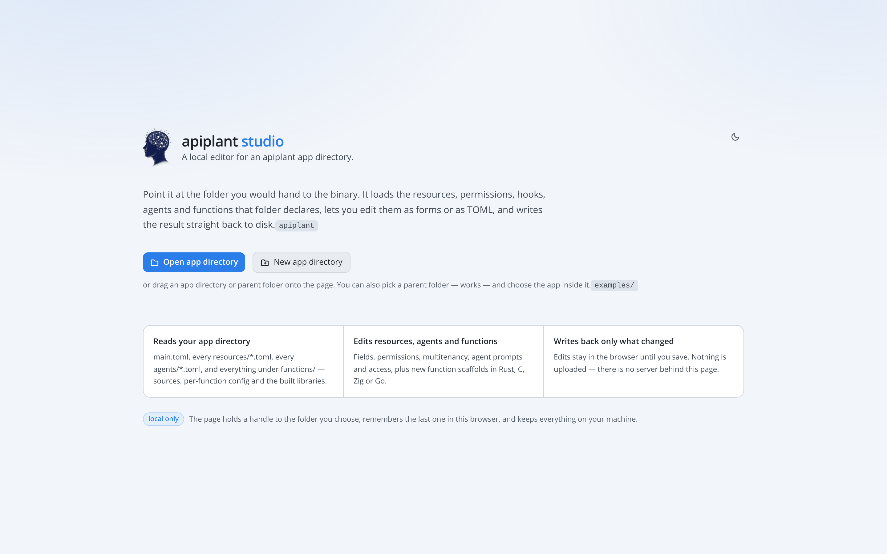
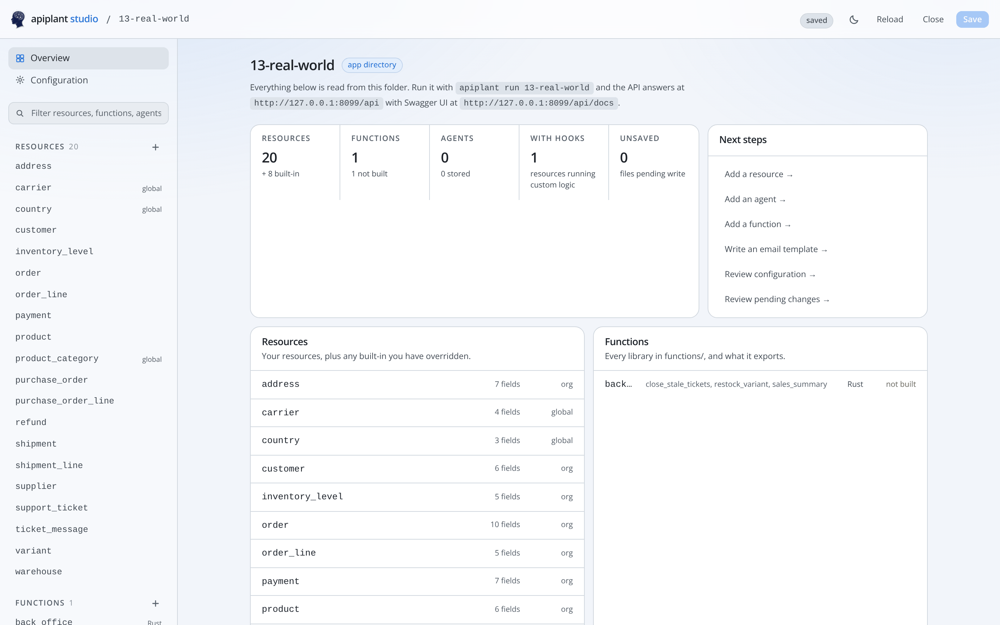
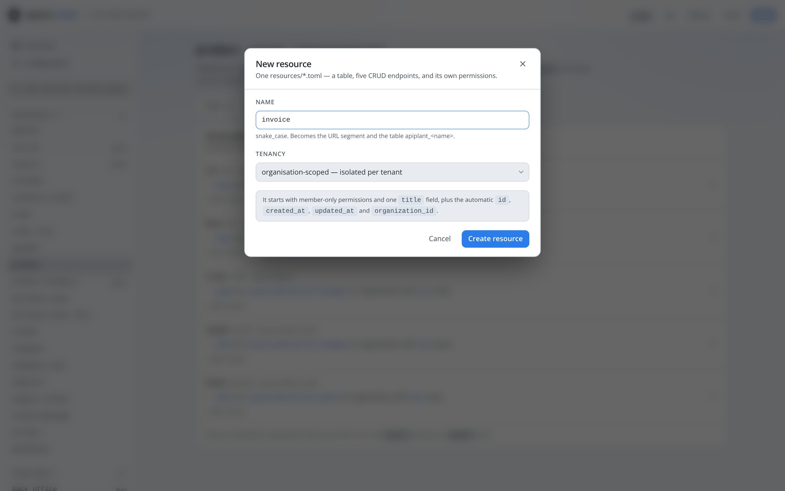
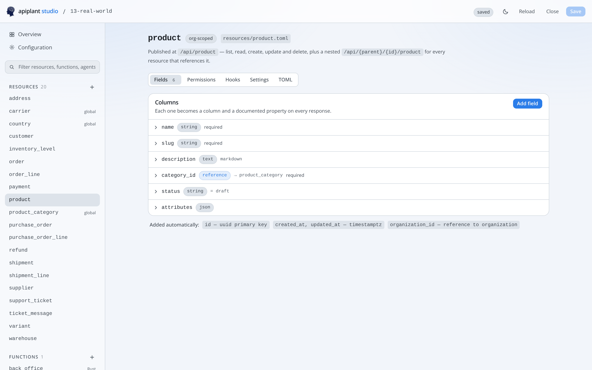
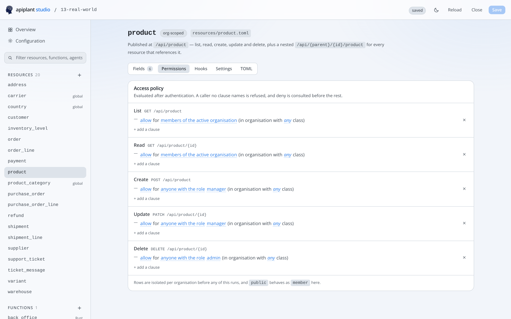
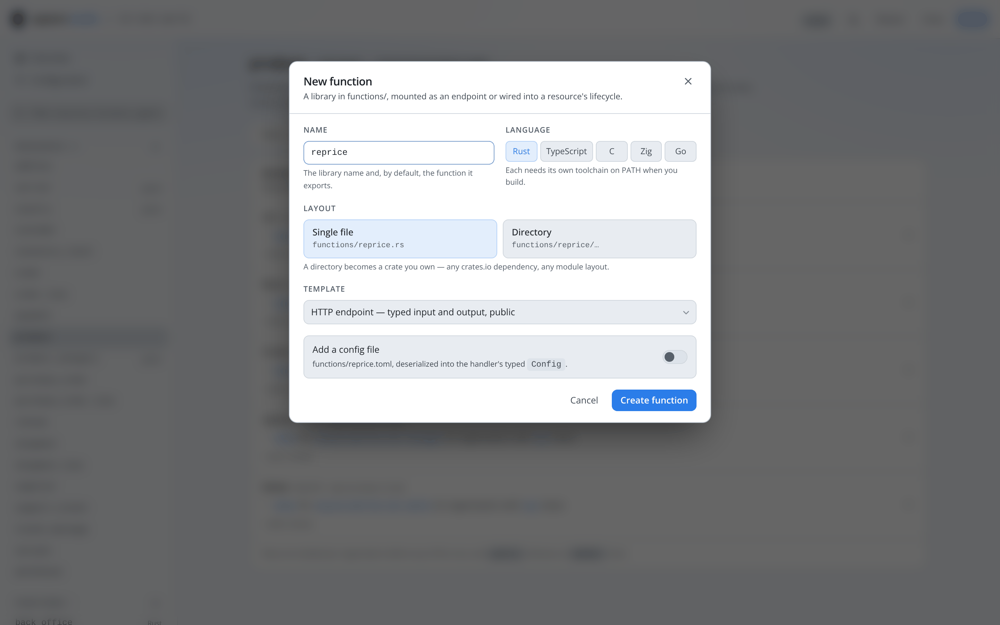
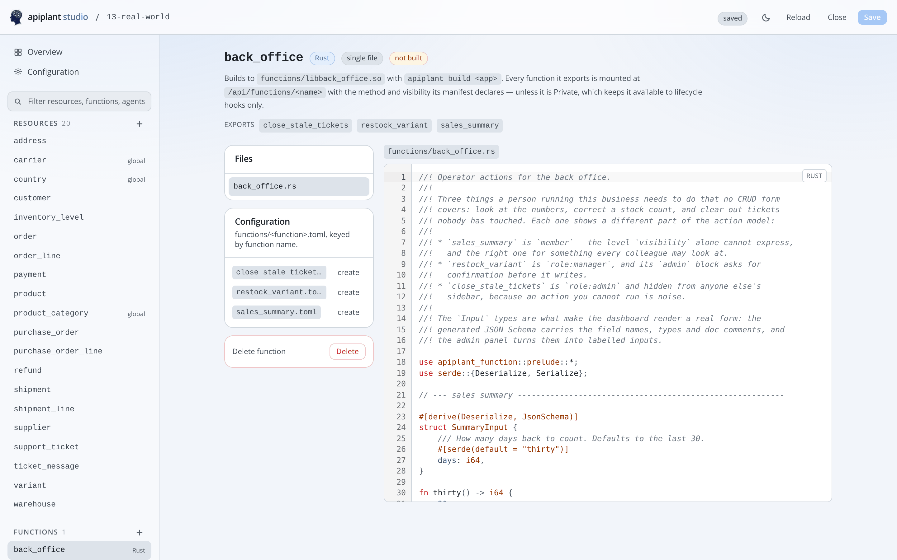
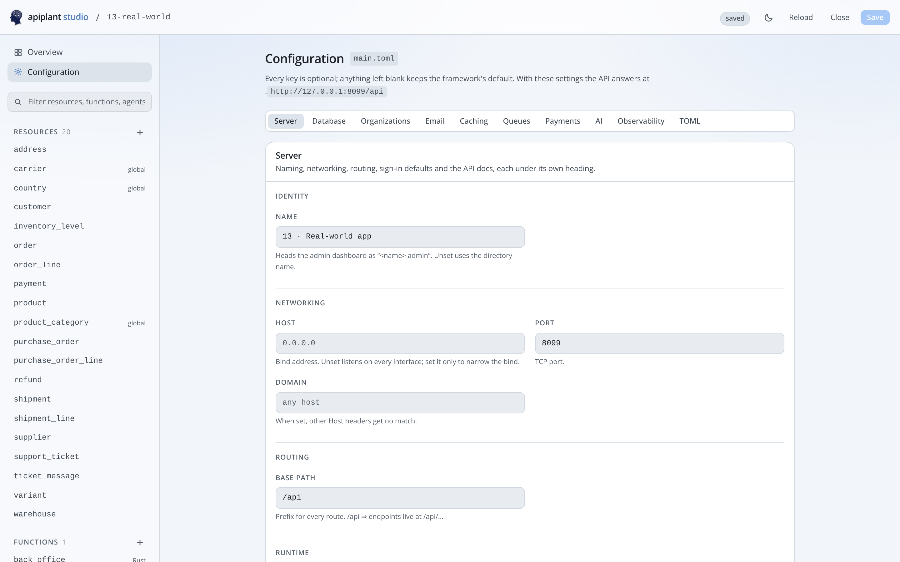
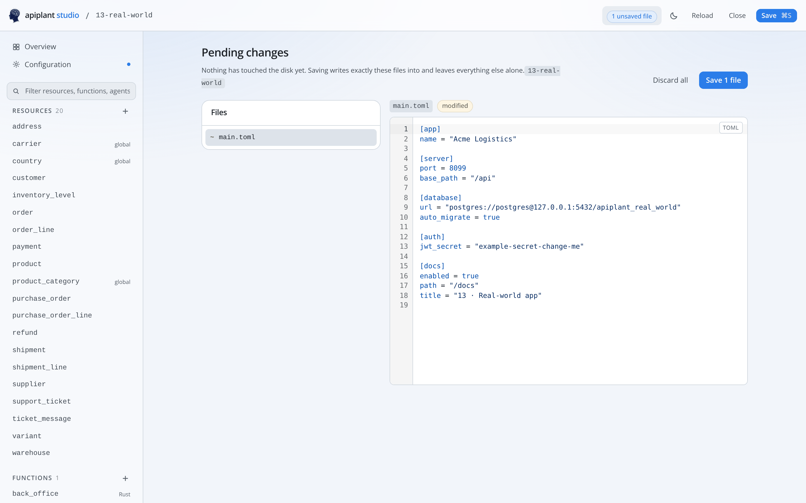

# The studio

An app directory is TOML, and TOML is a perfectly good way to write one. The
studio is the other way: point it at the folder you would hand to the
`apiplant` binary, and it loads the resources, permissions, hooks, agents,
email templates and functions that folder declares, lets you edit them as forms
or as TOML, and writes the result straight back to disk.

```bash
apiplant studio          # → http://127.0.0.1:5273
```

That command serves the editor out of the same binary — no `pnpm`, no checkout.
It binds loopback, and it is only a file server: **there is no backend**. The
page holds a [File System Access][fsa] handle to the directory you picked and
reads and writes it in place, so nothing is uploaded and nothing leaves the
machine.

That API is the whole permission model, and browser support is the one thing
to check before starting: Chrome, Edge, Opera and Arc have it; Firefox and
Safari do not, and the studio reports the missing API on the opening screen.



**Open app directory** picks the folder. You may also drag one onto the page, or
pick a *parent* folder — `examples/`, say — and choose the app inside it.

## What it edits

Everything below is read from the folder. Nothing is a copy, a project file or a
database of its own; close the tab and the directory is all that ever existed.

| Piece | What the studio gives you |
|-------|---------------------------|
| `main.toml` | Every section as a form — `[server]`, `[database]`, `[email]`, `[cache]`, `[queues]`, `[payments]`, `[ai]`, `[auth]`, `[docs]` and `[observability]` — with the framework's own default shown as the placeholder. |
| `resources/*.toml` | Fields and their types, the five permission actions, tenancy scope, `[admin]` settings, and `[auth]` on `user`. |
| Built-in resources | `organization`, `user`, `membership`, `api_key` and `oauth_connection`, listed with the definitions the framework ships. Editing one writes a `resources/*.toml` that overrides the default. |
| `[hooks]` | All ten events, picked from the function names the libraries in `functions/` actually export. A hook naming a function nothing exports is flagged. |
| `emails/*.liquid` | Subject and body, rendered live against sample values — as the mail client will show it, as the plain-text half beside it, and as the HTML that produced both. |
| `functions/` | New functions in Rust, TypeScript, C, Zig or Go. Sources and per-function config are editable in place; build output is listed and never touched. |

The Overview is where an app's shape is legible at a glance — how many
resources, which of them run custom logic, what each library exports, and the
command that runs this particular directory with the URLs it will answer on.



## Making something

### A resource

**New resource** — the `+` beside *Resources*, or the link on the Overview —
asks two questions and writes one `resources/<name>.toml`. That single file is a
table, five REST endpoints and its own permissions; see
[Resources](resources.md) for what the framework does with it.



The **name** is the resource's identity everywhere: the singular, snake_case
noun that becomes `/api/<name>`, the table `apiplant_<name>`, and the key other
resources use in a `references`. It is the one thing worth getting right before
pressing the button, because renaming later means a migration.

**Tenancy** is the other decision, and it is the one that is awkward to reverse:
organisation-scoped rows are isolated per tenant and carry an
`organization_id`, global rows are shared by everyone. [Multitenancy](multitenancy.md)
is the long version.

Then the fields. Each becomes a column, a documented property on every
response, and an input on the admin dashboard's form:



The tabs across the top are the whole resource. **Fields** is above;
**Hooks** attaches functions to its lifecycle; **Settings** covers the table
name, ownership, timestamps and the `[admin]` keys; and **TOML** is the same
file, editable as text, for anything the forms do not model — or to keep the
comments a form edit would drop.

`id`, `created_at`, `updated_at` and, for an org-scoped resource,
`organization_id` are added for you. They are listed under the fields rather
than hidden, because they exist on the API whether or not you wrote them.

### Its permissions

**Permissions** is the tab that decides who may do what, and it is worth
opening before the resource has any data in it. Each of the five actions gets a
block, and each clause under it is one sentence: *allow for members of the
active organisation in organisation with any class*. The words in blue are the
policy — what the clause does (allow, allow only if they own the row, or deny),
who it names, and the class of organisation it is narrowed to — and clicking
one turns it into the picker or the input that sets it.



Deny is consulted first, and a caller no clause names is refused — so an action
with nothing under it is a closed door, not an open one. Clauses that load but
do not mean what they read as — a grant a denial above it already cancels, a
`no-one` sitting beside clauses that expose the action anyway — are warned
about under the action they belong to. The
[Permissions](permissions.md) guide is the model in full; this screen is that model with the vocabulary
filled in from your own app, which is why the role picker offers the roles this
app actually uses.

### A function

**New function** scaffolds a library in `functions/`. Pick the language and the
layout — a single file, or a directory that becomes a crate, a Go module, an
npm project or a multi-file C or Zig project — and the generated template
compiles with `apiplant build` as written.



The **template** is the shape you want: an HTTP endpoint with typed input and
output, or a lifecycle hook. The config file toggle adds a
`functions/<name>.toml`, deserialised into the handler's own `Config` type — so
a function is configured by whoever deploys it rather than recompiled.

Afterwards the function page carries its source, its per-function config, and
what the library exports:



The studio never builds and never serves. `apiplant build` and `apiplant run`
stay exactly where they were — the Overview page has the command for the open
directory, filled in.

### Configuration

`main.toml` is the same story: a form per section, with the framework's default
as the placeholder, so an empty box is a documented behaviour rather than a
gap.



## Nothing is written until you save

Edits stay in the browser. **Pending changes** lists exactly which files will be
added, modified or removed, with the full contents of each — and that list is
the complete extent of what pressing Save does to the directory.



Nothing else is touched: not compiled libraries, not `https/` material, not the
files the studio does not model. Save with the button or ⌘/Ctrl+S; **Discard
all** puts everything back.

Two consequences worth knowing about:

* **A form edit rewrites the file.** A resource is re-emitted from the form, so
  hand-written comments in it are lost. The studio warns when the file on disk
  has comments — edit on the **TOML** tab to keep them. It is the same file
  either way.
* **Deleting a resource deletes its file, not its table.** apiplant's
  migrations are additive by design; dropping a column or a table stays a
  deliberate act you perform in SQL.

## Starting from nothing

**New app directory** goes the other way: pick the folder to hold it, name it,
and the studio creates that directory and stages a `main.toml` — plus an
optional example `note` resource — as *pending changes*. Nothing is on disk
until you press Save, so a brand-new app is reviewable exactly like any other
edit.

From there, [Configuration](configuration.md) is the reference for every key the
form offers, and [Resources](resources.md) for the field types.

## Where this sits

The studio edits an app directory. The [admin dashboard](admin.md) operates a
running one — different job, same design system, and the reason the two look
alike. You would use the studio to declare that `product` exists and who may
create one; you would use the dashboard to create one.

[fsa]: https://developer.mozilla.org/en-US/docs/Web/API/File_System_API
